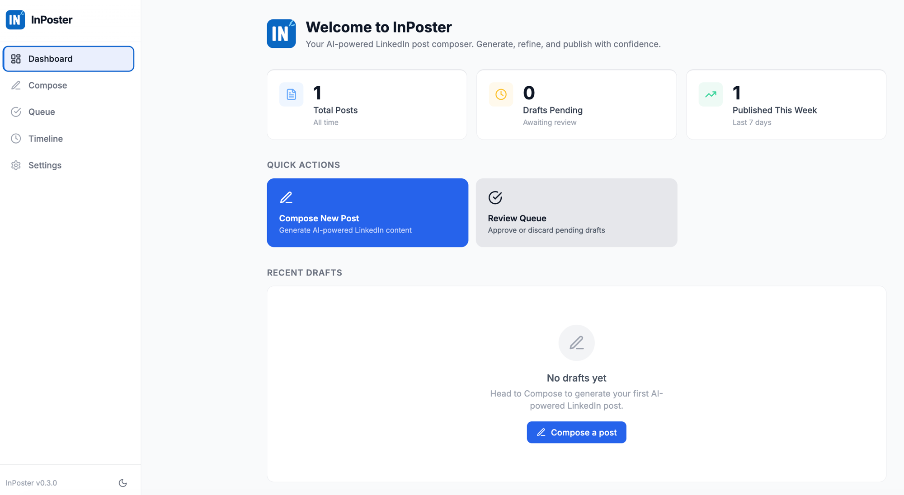
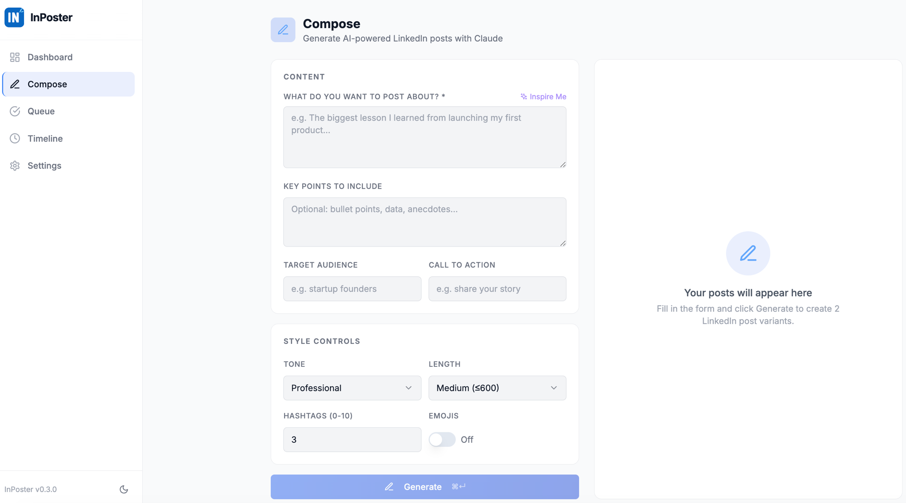
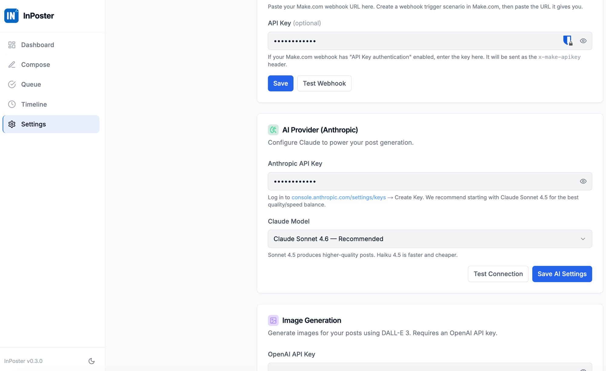
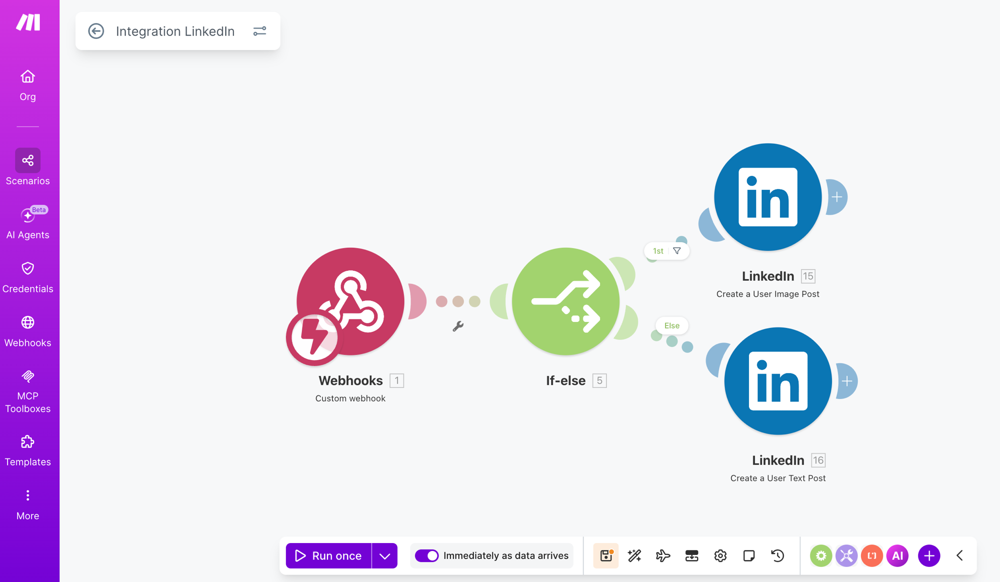
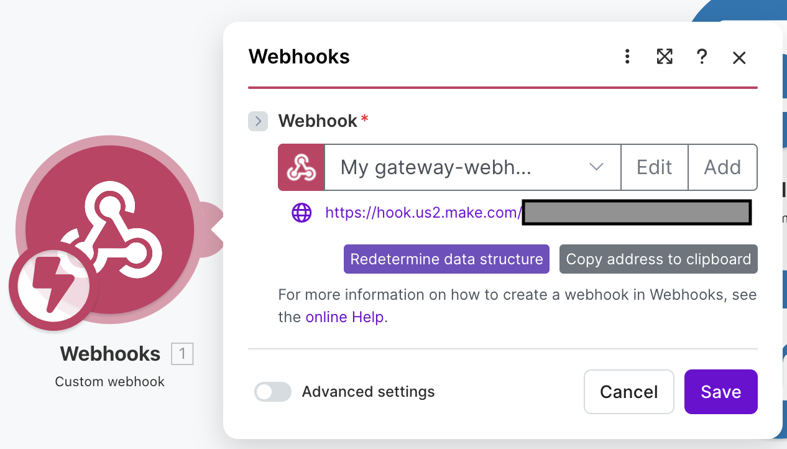
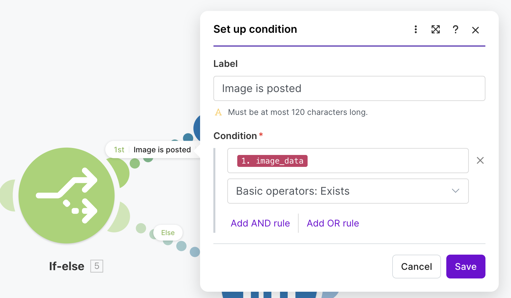
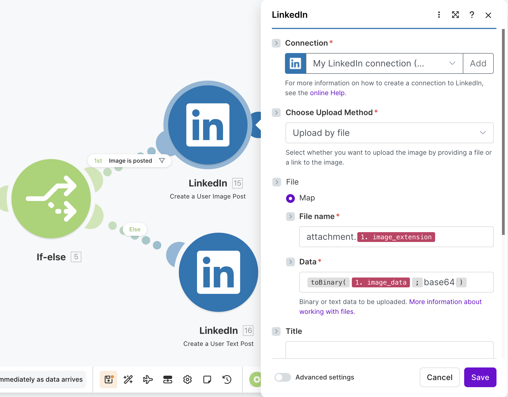
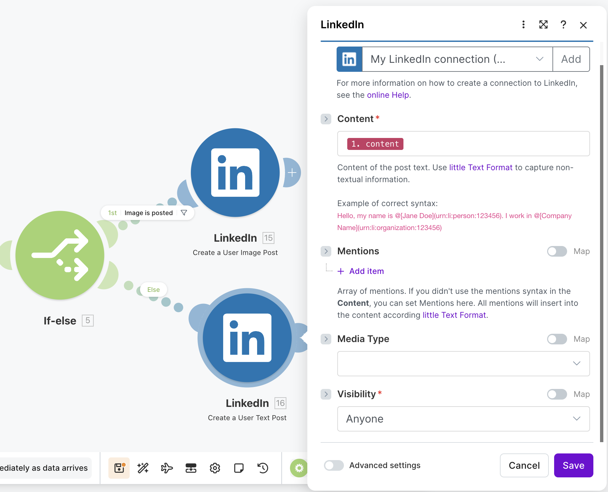

# InPoster

A local-first AI writing assistant for LinkedIn. Generate polished posts with Claude, attach photos from DALL-E or Unsplash, manage your approval queue, and publish via Make.com — all from a clean web UI running on your machine.

No cloud account, no subscription, no data leaving your machine except the API calls you explicitly make.

---

## Screenshots

| Dashboard | Compose |
|---|---|
|  |  |

| Settings |
|---|
|  |

---

## Features

- **AI Post Generation** — Describe a topic and get two ready-to-publish LinkedIn post variants generated by Claude (Anthropic). Control tone, length, hashtags, and emoji usage.
- **Approval Queue** — Kanban-style queue: Draft → Approved → Published. Edit and approve posts before they go out.
- **AI Image Generation** — Generate a matching image with DALL-E 3 (OpenAI). InPoster derives the prompt from your post content automatically, or you write your own.
- **Unsplash Photo Search** — Search millions of royalty-free photos directly in the app and attach one to any post with a single click.
- **Manual Image Upload** — Attach your own image (JPEG, PNG, GIF, WebP — up to 5 MB) to any draft.
- **Publish via Make.com** — One-click publishing triggers a Make.com webhook, which handles the actual LinkedIn post. No direct LinkedIn API credentials required.
- **Local SQLite database** — All posts and settings stored locally in a single SQLite file. No server, no cloud sync.

---

## Tech Stack

| Layer | Technology |
|---|---|
| Framework | Next.js 14 (App Router) |
| Language | TypeScript |
| Database | SQLite via Drizzle ORM + better-sqlite3 |
| Styling | Tailwind CSS + shadcn/ui |
| AI — Text | Anthropic Claude (claude-sonnet-4-6) |
| AI — Images | OpenAI DALL-E 3 |
| Stock Photos | Unsplash API |
| Publishing | Make.com webhook |
| Icons | lucide-react |
| Toasts | Sonner |

---

## Getting Started

### Prerequisites

- Node.js 18+
- npm
- An [Anthropic API key](https://console.anthropic.com/settings/keys) (required for post generation)
- A [Make.com](https://make.com) account with a webhook scenario (required for publishing)
- An [OpenAI API key](https://platform.openai.com/api-keys) (optional — for DALL-E 3 image generation)
- An [Unsplash Access Key](https://unsplash.com/developers) (optional — for stock photo search)

### Installation

```bash
git clone https://github.com/nsid32/inposter.git
cd inposter
./scripts/setup.sh
```

`scripts/setup.sh` installs dependencies, creates `.env.local`, and initialises the SQLite database.

### Running

```bash
./scripts/run.sh
```

Opens at [http://localhost:3000](http://localhost:3000).

---

## Configuration

All configuration lives in the **Settings** page at `/settings`. Nothing requires editing config files manually.

| Setting | Where to get it | Required |
|---|---|---|
| Anthropic API Key | [console.anthropic.com/settings/keys](https://console.anthropic.com/settings/keys) | Yes |
| Make.com Webhook URL | Create a webhook trigger scenario in Make.com | Yes (for publishing) |
| Make.com API Key | Your Make.com webhook settings (if auth enabled) | Optional |
| OpenAI API Key | [platform.openai.com/api-keys](https://platform.openai.com/api-keys) | Optional |
| Unsplash Access Key | [unsplash.com/developers](https://unsplash.com/developers) | Optional |

Configure everything from the **Settings** page at [http://localhost:3000/settings](http://localhost:3000/settings) — no manual file editing required.

All API keys are stored AES-256-GCM encrypted in the local SQLite database.

### Make.com Setup

InPoster publishes posts by sending a webhook payload to Make.com. Make.com then posts to LinkedIn on your behalf. The scenario handles both text-only posts and posts with images.

#### Step 1 — Create the scenario

Create a new Make.com scenario with three modules: **Webhooks → If-else → LinkedIn**.



#### Step 2 — Configure the Webhook trigger

Add a **Webhooks → Custom webhook** module. Click **Add**, give it a name, and copy the webhook URL — you'll paste this into InPoster Settings.



After saving, click **Run once** in Make.com, then publish a post from InPoster. Make.com will capture the data structure automatically.

#### Step 3 — Add an If-else router

Add a **Flow control → If-else** module after the webhook. Set the condition:

- **Label:** `Image is posted`
- **Condition:** `1. image_data` → **Basic operators: Exists**



This routes posts with an image to the image branch, and text-only posts to the else branch.

#### Step 4 — Image branch: Create a User Image Post

On the **1st (Image is posted)** branch, add **LinkedIn → Create a User Image Post** and configure it:

- **Connection:** your LinkedIn connection
- **Choose Upload Method:** `Upload by file`
- **File name:** `attachment.` + `1. image_extension`
- **Data:** `toBinary( 1. image_data ; base64 )`
- **Content:** `1. content`
- **Visibility:** `Anyone`




#### Step 5 — Else branch: Create a User Text Post

On the **Else** branch, add **LinkedIn → Create a User Text Post** and configure it:

- **Connection:** your LinkedIn connection
- **Content:** `1. content`
- **Visibility:** `Anyone`



#### Step 6 — Paste the webhook URL into InPoster

Go to InPoster **Settings → Make.com** and paste the webhook URL copied in Step 2. Enable **Immediately as data arrives** in Make.com so the scenario runs the moment InPoster triggers it.

---

## Troubleshooting

**`./scripts/setup.sh` fails with "permission denied"**
Run `chmod +x scripts/setup.sh scripts/run.sh` then try again.

**Port 3000 is already in use**
Another process is using port 3000. Stop it, or set a custom port:
```bash
PORT=3001 ./scripts/run.sh
```
Then open http://localhost:3001.

**`./scripts/run.sh` says "Dependencies not installed"**
You need to run setup first: `./scripts/setup.sh`

**Database errors on startup**
Delete `data/inposter.db` and run `./scripts/setup.sh` again to reinitialise the database.

**App loads but AI features don't work**
Go to Settings and add your Anthropic API key. The app runs without it but cannot generate posts.

---

## Project Structure

```
├── src/
│   ├── app/
│   │   ├── page.tsx              # Dashboard
│   │   ├── compose/page.tsx      # AI Post Composer
│   │   ├── queue/page.tsx        # Approval & Publishing Queue
│   │   ├── settings/page.tsx     # Settings
│   │   └── api/                  # API routes
│   ├── components/               # Shared UI components
│   └── lib/                      # DB, settings, crypto utilities
├── drizzle/                      # SQL migration files
├── data/                         # SQLite database (gitignored)
├── scripts/
│   ├── run.sh                    # Dev server launcher
│   ├── setup.sh                  # One-time setup script
│   └── release.sh                # Version bump & release
```

---

## Development

```bash
# Start dev server
./scripts/run.sh

# Generate a new DB migration after schema changes
npm run db:generate

# Apply migrations
npm run db:migrate

# Open Drizzle Studio (database GUI)
npm run db:studio

# Lint
npm run lint

# Cut a release (bump version, update changelog, commit, tag, push)
./scripts/release.sh

# Preview what the next release would do
./scripts/release.sh --dry-run
```

The release script uses [Conventional Commits](https://www.conventionalcommits.org/) to determine the version bump automatically and updates `CHANGELOG.md` with grouped entries.

- `fix:` commits → patch (0.1.0 → 0.1.1)
- `feat:` commits → minor (0.1.0 → 0.2.0)
- `BREAKING CHANGE` in commit body → major (0.1.0 → 1.0.0)

---

## Privacy

InPoster is designed to keep your data local:

- All posts, settings, and API keys are stored in a local SQLite file (`data/inposter.db`)
- API keys are encrypted at rest (AES-256-GCM)
- The only outbound network calls are the ones you trigger: Anthropic API, OpenAI API, Unsplash API, and your Make.com webhook
- No telemetry, no analytics, no accounts

---

## License

MIT
